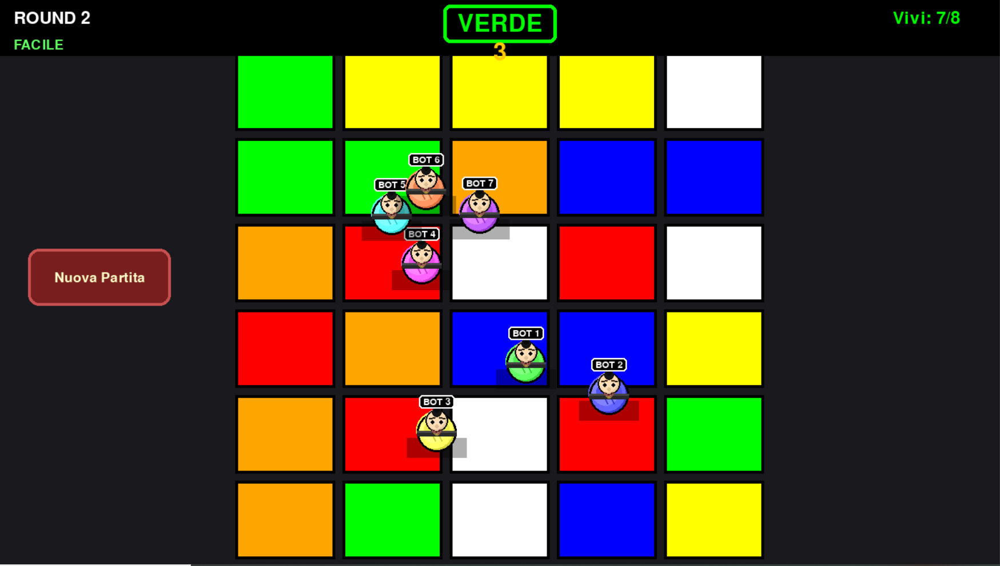
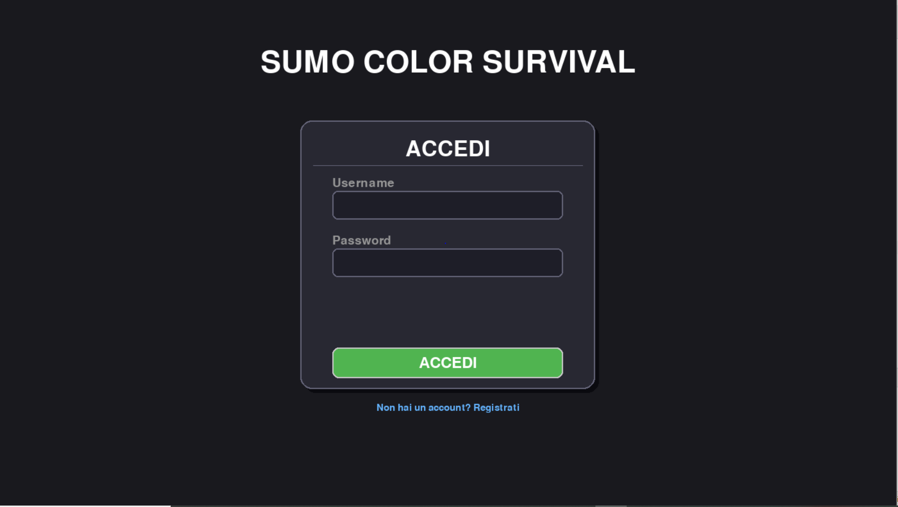
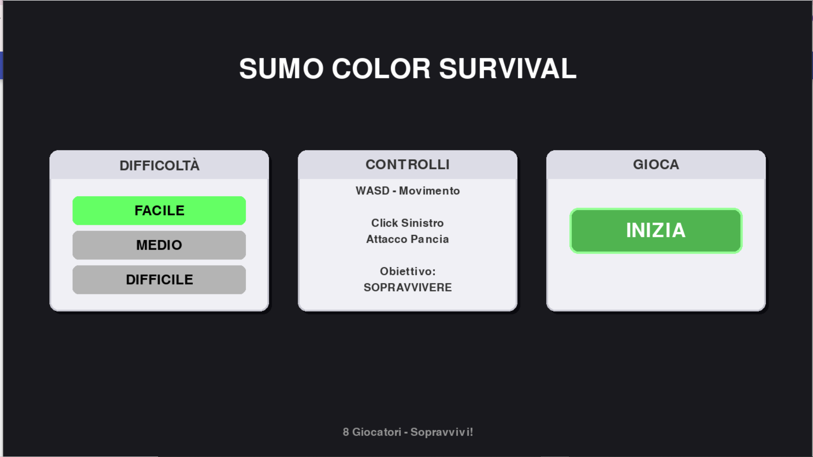

# 🥊 Sumo Color Survival

 

> *Jump, push, survive. But most importantly... stay on the right color.*

 

---

 

# ## 🎮 What is it?

 

**Sumo Color Survival** is a frantic PC game where fighters clash on a grid of colored platforms.

Each round the game announces a **target color**: anyone left on a platform of the wrong color... falls into the abyss!

Outlast all your opponents to win.

---

 

## ⚡ How to play

 

| Key | Action |

|---|---|

| `W A S D` | Move your fighter |

| Left click | Push enemies |

| `SPACE` | Return to menu (after a match) |

 

1. **Log in** or **sign up**

2. Choose your difficulty

3. When the target color appears, **run to the right platform**

4. When the countdown ends, wrong-colored platforms disappear

5. Anyone who falls is eliminated — last one standing wins the round!

 

---

 

## 🏆 Game modes

 

### 🟢 EASY

Slow and predictable bots. Perfect for learning the mechanics.

 

### 🔴 HARD

Fast and aggressive bots. Only the best make it onto the **leaderboard**!

Wins in Hard mode are saved and displayed on a global leaderboard at the end of each match.

 

---

 

## 👾 Colors in the game

 

The game features **6 platform colors**, randomly shuffled each round:

 

🟥 Red · ⬜ White · 🟨 Yellow · 🟦 Blue · 🟧 Orange · 🟩 Green

 

---

## 👥 Authors

---

### Organization of the project

The entire project was developed by Manzotti and Giorgi with the help of ‘claude.ai’; all the modules included are the result of their collaboration.

Made by Manzotti Leonardo and Giorgi Paolo.
